# Project
## Papa Jon's Pizzaria

* Introduction
* Plan for Project
* Project Tracking
* Entity Relationship Diagram
* Risk Assesment 
* Design
* Deployment
* Technology Used
* Testing
* Improvements for future 
* Author  
* Acknowledgements
* License

### Introduction
The aim for this project was to create a fully functioning CRUD apllication with utilisation of supporting tools, methodologies and technologies that encapsulate all core modules covered during training more specifically:
* Project Management
* Python Fundamentals
* Python Testing
* Git
* Basic Linux
* Python Web Development
* Continuous Integration
* Cloud Fundamentals
* Databases

## Plan for Project
For my project I chose to make a Pizza Delivery application that would allow the user to enter their details and order a pizza. There are 2 SQL tables one of them contains the Stock, the purpose of this table is to match the entered PizzaID and display the name of that pizza. The other table is the Orders table, the purpose of this table is to take in the customers details and what pizza number they would like, to then display their order on the home page.

## Project Tracking
To track the development of my progress I used a Kanban Trello Board, using this helped me track each stage of my project and see which sections i had completed or still needed working on, improving my overall efficiency and not spending time trying to workout where I left off yesterday.  
In the Trello Board I added a section for user storys under project tracking these were requested for the project, I then broke them down and turned them into tasks for my board that could be completed.
#### Before Completion
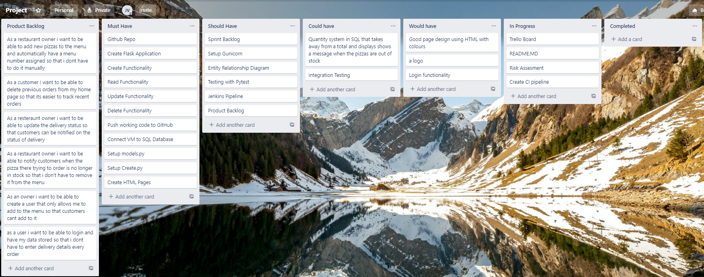
#### After Completion
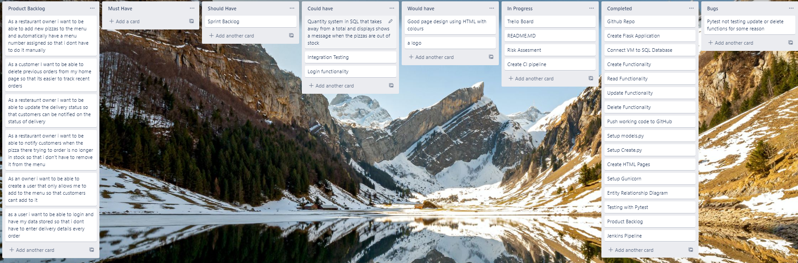  
As you can see i added a bug section to the trello board to track any bugs i had encountered during project development. Fortunately only 1 to my knowledge is still in the final version of the project and it is do to with testing so causes no harm to project functionality.

## ERD
This was my first draft of my ERD which shows the relationships and the cloumns of my SQL database. The original plan was to have it setup so that the Stock table would have a quantity with the number of pizzas in stock which would display a message if there was no stock remaining and a price per pizza function which would display the total cost of the order 
based on how many of that particular pizza was placed in the Orders section.
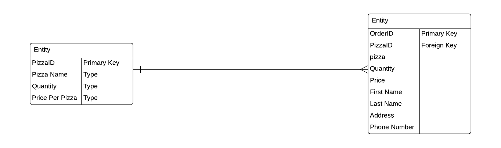
During development my entity relationship diagram changed due to time constraints some of the features I talked about above I was unable to implement so changes to models had to be made and adapted so the project could be completed in time. (Current version of ERD displayed below)
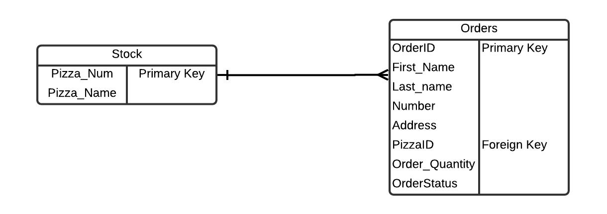

## Risk Assesment
In my risk assesment I identified some potential risks for the creation of my project and likeliness of this happening as you can see below I ranked the impact of that risk from 1 being slightly problematic and 3 being a very problematic risk, and the likelihood of that risk occuring from 1 being unlikely and 3 being very likely.  
Shown below is my risk assesment
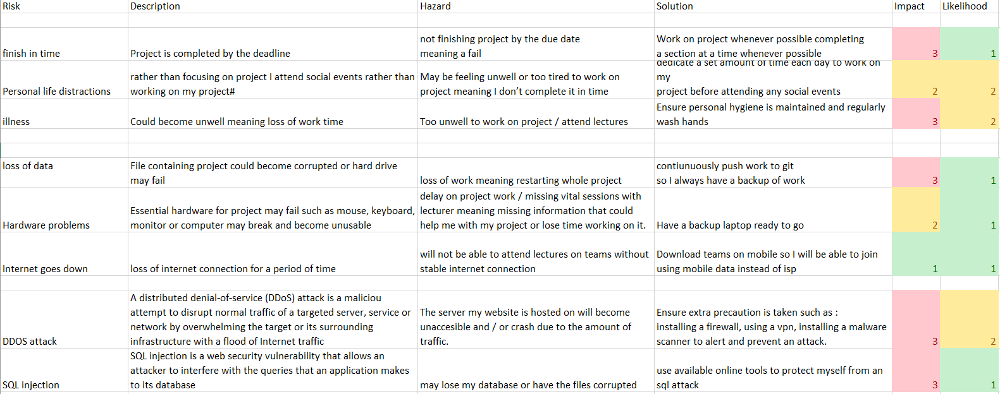
#### Revisited Risk Assesment  
Once my project had been completed I went over risk assesment and added an update section. In this section I commented wether or not i had encountered that specific risk during my development  
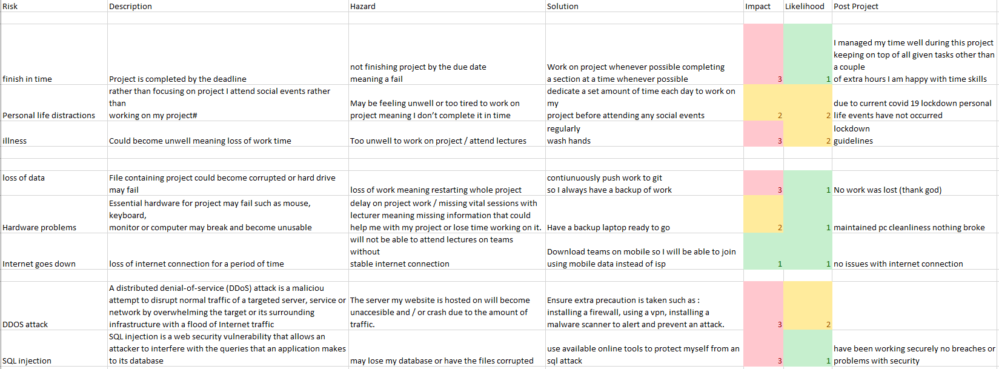

## Design
Shown below is each page of my website given more time I would like to focus more on the styling and layout of the website.
### Home Page
Shown below is my home page this page is setup to display placed orders with entered information. It also allows the delivery status to be updated and the order to be deleted from the sql table, which meets the update and delete functionality for CRUD.
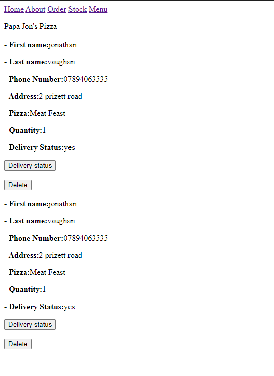
### Stock Page
This page allows the user to add new pizza to the menu page and automatically have a menu item number assigned
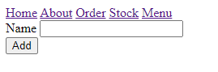
### About Page
This is my about page where the owner could talk about the history of the pizza place and fill it with more information
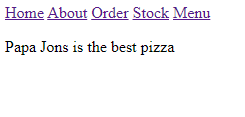
### Menu
This page displays menu items added in from the stock page and shows the assigned menu order number
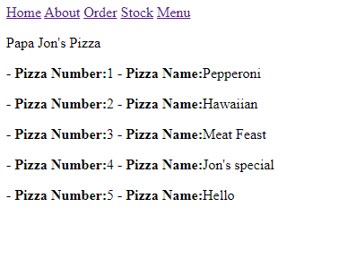
### Order
This is where users place Orders which are then displayed on the home page
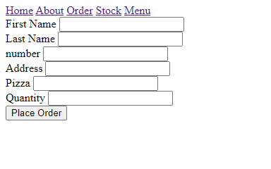
### Delivery Status
This page can only be acccessed from the home page and allows the delivery status for the paticular order to be edited.
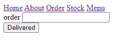

## Deployment
This Diagram is my CI pipeline which shows how I setup my application  to automate software delivery process.
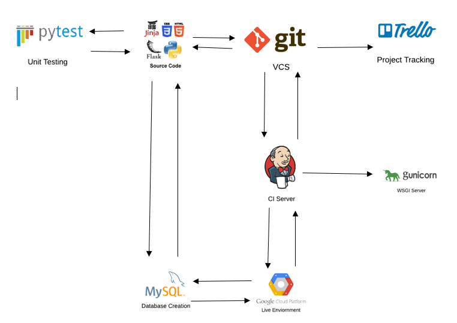

### Technologies Used
* Trello: for project tracking
* Github: Version Control System, and Jenkins WebHook
* Google Cloud Platform: Virtual Machine for application and SQL Database
* Mysql: Allows creation of SQL Databases and Tables
* Jenkins: Continuous Integration Server builds application after every push to github
* PyTest: Tests code functions and offers coverage to see how much is tested
* Gunicorn: WSGI to run python web app
* Visual Studio Code

### Languages Used
* Python3
* CSS
* HTML
* Flask
* Jinja2

## Testing
Pytest was used for testing  
The results for testing  
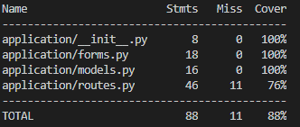   
As you can see i managed to get 100% coverage for testing on every file other than my routes due to time constraints I was unable to resolve the issue with testing coverage. I have written the code to test the update and delete function but for some reason i am unable to get the coverage to be counted for them this is something I would like to resolve given the time.  
Update testing:  
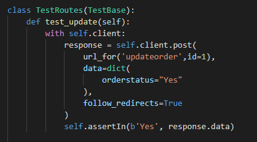  

Delete testing:  
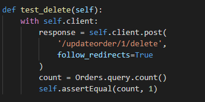

Due to time constraints I was unable to implement Selenium for integrated testing

## Improvements for future
During the development process of my project there were many ideas / features that I wanted to implement but was unable due to time constraints.

At the moment there is no price displayed for the pizza ordered quantity, given more time I would like to implement a feature that takes the specific pizza price from the stock table and multiplys it by the quantity ordered of that pizza

I would also like to implement a dropdown menu that displays all pizzas in the menu and automatically fill the id section for the pizza chosen in the dropdown rather than customers having to go to the menu page look for the pizza item number they want and inserting it into the order.

The overall design of the website has not been worked on given more time i would focus on creating a logo and the general layout of the page adding colours and generally just a more clean and professional layout

Implement Integrated Testing using selenium

Add a login function for admins and users

Get testing to 100% coverage

## Author
__Jonathan Vaughan__

## Acknowledgements
* My fantastic trainers who have given me the advice and training needed for this project of which i am very proud.
* My good friends in group 4

## License
MIT License

Copyright (c) 2020 JonathanVaughan

Permission is hereby granted, free of charge, to any person obtaining a copy
of this software and associated documentation files (the "Software"), to deal
in the Software without restriction, including without limitation the rights
to use, copy, modify, merge, publish, distribute, sublicense, and/or sell
copies of the Software, and to permit persons to whom the Software is
furnished to do so, subject to the following conditions:

The above copyright notice and this permission notice shall be included in all
copies or substantial portions of the Software.

THE SOFTWARE IS PROVIDED "AS IS", WITHOUT WARRANTY OF ANY KIND, EXPRESS OR
IMPLIED, INCLUDING BUT NOT LIMITED TO THE WARRANTIES OF MERCHANTABILITY,
FITNESS FOR A PARTICULAR PURPOSE AND NONINFRINGEMENT. IN NO EVENT SHALL THE
AUTHORS OR COPYRIGHT HOLDERS BE LIABLE FOR ANY CLAIM, DAMAGES OR OTHER
LIABILITY, WHETHER IN AN ACTION OF CONTRACT, TORT OR OTHERWISE, ARISING FROM,
OUT OF OR IN CONNECTION WITH THE SOFTWARE OR THE USE OR OTHER DEALINGS IN THE
SOFTWARE.

